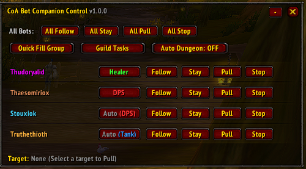
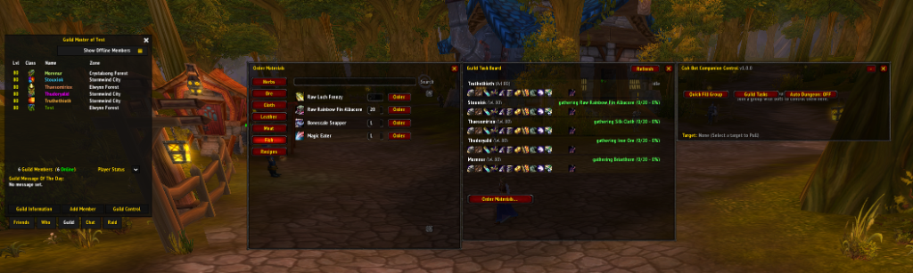

# CoA Companions (mod-coa-playerbots)

AI companion bots that can play [Conquest of Azeroth](https://github.com/jealous-sound/azerothcore-wotlk-coa)'s
21 custom Ascension classes — built for real dungeon/raid/leveling groups,
not just standing around.

**Status: Live & in active development**, powering bot populations in the thousands on Conquest of Azeroth.

---

## Overview

Unlike standard 3.3.5 bot engines ([NPCBots](https://github.com/trickerer/AzerothCore-wotlk-with-NPCBots) or [Playerbots](https://github.com/mod-playerbots/mod-playerbots)) which only support the original 10 vanilla/WotLK classes, **CoA Companions** is designed from the ground up to natively understand and play Ascension's 21 custom classes and their unique mechanics.

Every companion is driven by a data-driven Utility AI combat engine with strict retail-style specialization rules (one dedicated specialization tree per companion), complete with custom spell priority queues, resource management, triage healing, active tank mitigation, and tactical group awareness.

---

## Screenshots

### Companion Control UI (CoABotUI)
Real-time floating control HUD for companion orders, formations, stances, and direct combat commands.

### Guild Roster & Taskboard
Guild taskboard and management interface showing companions participating in guild progression.

---

## Supported Classes & Specializations

CoA Companions provides dedicated AI combat profiles for all **21 Conquest of Azeroth classes**, adhering strictly to modern retail WoW 1-tree specialization mechanics:

| Class ID | Class Name | Supported Specializations | Supported Roles |
| :--- | :--- | :--- | :--- |
| **12** | **Barbarian** | Berserker (90), Juggernaut (91) | Melee DPS, Tank |
| **13** | **Primalist** | Totemist (93), Shaman (94), Geomancy (95) | Healer, Melee DPS, Ranged DPS |
| **14** | **Pyromancer** | Firestorm (96), Magma (97) | Ranged DPS |
| **15** | **Chronomancer** | Time (99), Warp (100) | Healer, Ranged DPS |
| **16** | **Cultist** | Void (102), Madness (103) | Ranged DPS |
| **17** | **Tinker** | Engineering (105), Artillery (106) | Tank, Ranged DPS |
| **18** | **Sun Cleric** | Dawn (44), Eclipse (45), Piety (46) | Healer, Ranged DPS |
| **19** | **Witch Doctor** | Shadowhunting (4), Voodoo (5) | Healer, Ranged DPS |
| **20** | **Necromancer** | Blood (7), Bone (8), Decay (9) | Tank, Ranged DPS, Caster |
| **21** | **Felsworn** | Chaos (11), Havoc (12) | Melee DPS, Tank |
| **22** | **Knight of Xoroth** | Annihilation (14), Torment (15) | Tank, Melee DPS |
| **23** | **Guardian** | Sentinel (17), Watcher (18) | Tank, Melee DPS |
| **24** | **Starcaller** | Astral (20), Luminary (21) | Healer, Ranged DPS |
| **25** | **Bloodmage** | Crimson (23), Siphon (24) | Healer, Ranged DPS |
| **26** | **Runemaster** | Arcane (62), Runic (63) | Melee DPS, Tank |
| **27** | **Reaper** | Harvest (29), Scythe (30) | Melee DPS |
| **28** | **Venomancer** | Poison (32), Toxicity (33) | Healer, Ranged DPS |
| **29** | **Stormbringer** | Tempest (35), Thunder (36) | Tank, Melee DPS |
| **30** | **Templar** | Crusader (38), Zealot (39) | Tank, Melee DPS |
| **31** | **Witch Hunter** | Inquisition (41), Purge (42) | Ranged DPS, Melee DPS |
| **32** | **Ranger** | Marksman (47), Survival (48), Beastmaster (49) | Ranged DPS |

---

## Core Systems & Capabilities

- **Data-Driven Utility AI Engine**:
  - HealerEngine: Weighted triage system taking into account missing HP%, incoming damage rate, HoT presence, tank priority, mana efficiency, and emergency burst healing.
  - TankEngine: Active mitigation upkeep, peel rotations for aggro lost to healers/casters, positioning, and taunt management.
  - DpsEngine: Target selection (focus lowest HP, priority adds, skull targets), execute phase burst, resource pools (Mana, Energy, Rage, Focus, Runes, Heat), and cooldown alignment.
- **Client Addon (CoABotUI)**:
  - In-game floating widget for commanding your companion squad without typing GM commands.
  - Formations: Shieldwall, Arrowhead, Circle, Flank, Line.
  - Stances: Aggressive, Defensive, Passive, Assist.
  - Fast commands: Attack Target, Pull, Peel, Hold Position, Regroup.
- **World & Group Integration**:
  - Auto-Dungeon Finder and Battleground queue filler.
  - Smart loot distribution and greed/need rolling.
  - Leveling and zone progression from 1 to 80 with automatic talent allocation per spec build.
  - Racial mount usage and intelligent pathing.

---

## Installation

See [INSTALL.md](INSTALL.md) for full setup instructions, including precompiled quick-install for repack users and source build instructions for core developers.

---

## Documentation

- [INSTALL.md](INSTALL.md) — Detailed setup, installation and troubleshooting guide.
- [AGENTS.md](AGENTS.md) — Technical context and conventions for core developers and AI assistants.
- [docs/capabilities.md](docs/capabilities.md) — Deep-dive into implemented behaviors and systems.
- [docs/addon-protocol.md](docs/addon-protocol.md) — Wire protocol specifications for client-addon communication.
- [docs/architecture.md](docs/architecture.md) — High-level architecture and core integration strategy.
- [docs/core-patches.md](docs/core-patches.md) — Required core patches and diff rationale.

---

## License / Attribution

Builds on research into [mod-playerbots](https://github.com/mod-playerbots/mod-playerbots) (GPL-2.0, per AzerothCore conventions) and [azerothcore-wotlk-coa](https://github.com/jealous-sound/azerothcore-wotlk-coa). All custom class combat profiles and utility AI engines are original works developed specifically for Conquest of AzerothCore project.
